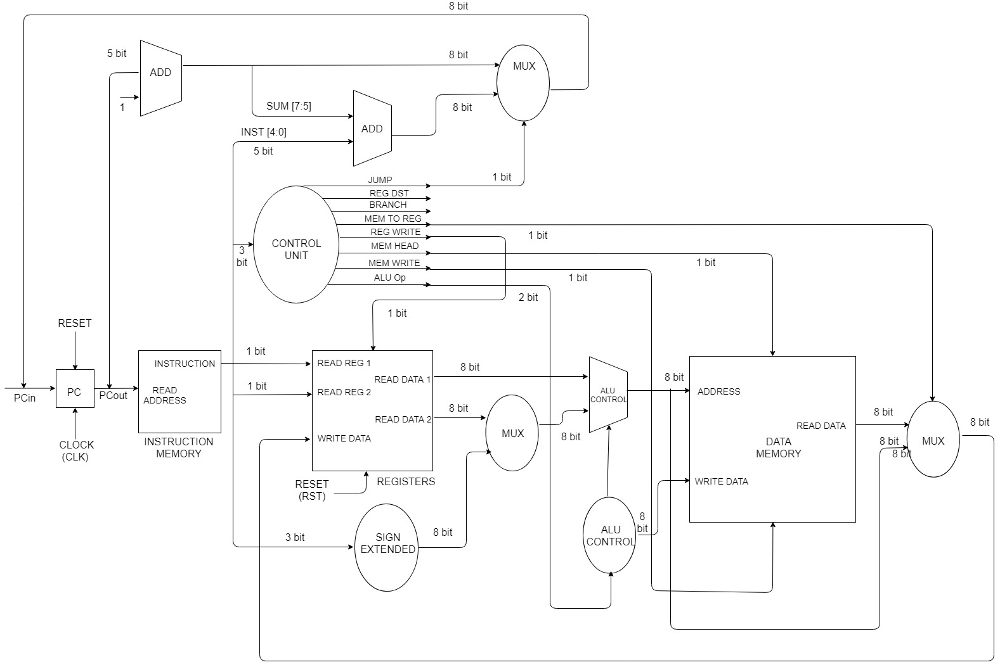

# CSE590_8Bit_Microprocessor
In this design we have used a program counter, adders and multiplexers, a control unit, an ALU and registers. 
 We have the Instruction memory and data memory which is used for storage. 
 We give the imput (PCin) in the program counter which is fed in the instruction memory. 
 The output data is fed in the register. In the register, Read reg1 is defined by the sourse register, Read Reg 2 is defined by the destination register. 
 While input for the Write data is given by the output of the multiplier. 
 This multiplexer is triggered if the Instruction set consists of an instruction which requires data to be loaded in the register from memory (Example: Load Instruction). Also, the PC out is used as input to the adder which increments its value by 1 bye which gives the address of the next instruction. 
 It gives a 8 bit output. The first 3 bits are used as input for another adder along with the last 5 bits (from the instruction memory). 
 This adder gives the concatenated output which is fet to a multiplexer which is enabled by jump control signal. 
 The first three bits of the input array, is used by the control unit to decode the opcode. 
 Accordingly, it gives the output which is used to trigger the multiplexers, registers, data memory and ALU Control. 
 From the register, the data is sent to the ALU Result, where the arithmatic operation is performed. 
 Later the computed data is sent to the Data Memory and the output is given accordingly.

Block Diagram - 

